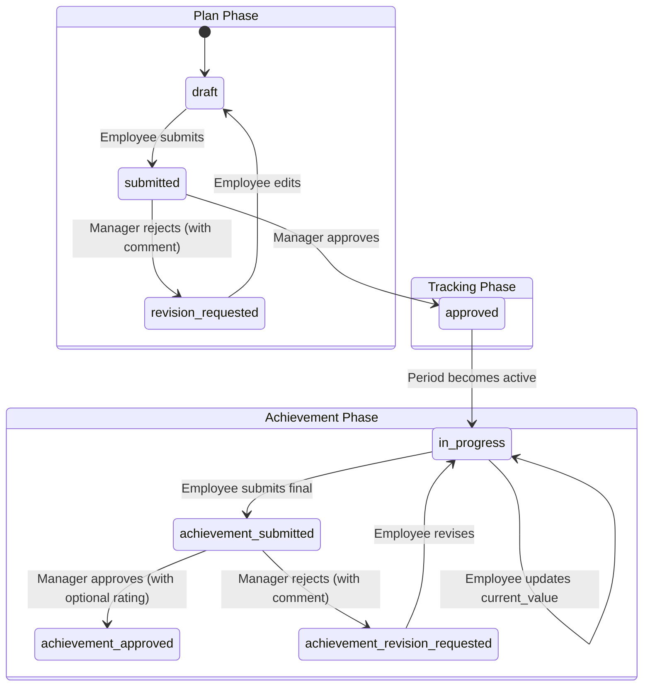

# Kubera — Build Plan: Asset Management, Sales Tracking, KRA & Appraisal

> **Status:** Ready for implementation
> **Decided via:** Grill-me session (2026-07-10)
> **Phases:** 5 (each independently testable)

---

## Decisions Summary

| Decision | Choice |
|---|---|
| Auth model (§0) | **(A) Real employee logins** — extend `CompanyUser` with `employee`/`manager` roles |
| Table structure | Single `CompanyUser` table with new roles, not a separate `Employee` table |
| Manager hierarchy | Self-referencing `manager_id` FK on `CompanyUser` |
| Employee onboarding | Admin creates accounts (no self-registration, no invite emails) |
| Custom fields model | JSONB `custom_fields` + shared `CustomFieldDefinition` table with `module` discriminator |
| Custom field removal | Soft-delete (`is_active = false`), data preserved on existing rows |
| Asset status | Yes — `active`, `under_maintenance`, `disposed`, `in_storage` enum |
| Asset → DocVault link | Yes — `AssetDocument` junction table |
| Depreciation | Store fields only (`useful_life_years`, `salvage_value`, `depreciation_method`), no calculation |
| Asset categories | Yes — `AssetCategory` table |
| Asset custodian | Yes — optional `assigned_to` FK on asset |
| Import validation | Row-level: skip invalid rows, return error report |
| Sale attribution | `created_by` (server-set) + optional `attributed_to` override |
| Sales visibility | Manager-hierarchy scoping (own + direct reports; admin sees all) |
| Sales targets | None — use KRA for goal-tracking |
| Sale status | Yes — `pending`, `confirmed`, `cancelled` |
| Sales aggregation | Yes — basic totals by employee/period |
| KRA target types | 5-type enum: `numeric`, `percentage`, `boolean`, `rating`, `text` |
| KRA scoring | Optional weighted score per KRA item |
| KRA rejection flow | Revision loop with manager comment |
| KRA cycle scope | Single company-wide cycle |
| Manager feedback | Comment + optional 1-5 rating at approval gates |
| KRA templates | Yes — company-level `KraTemplate` table |
| KRA ↔ Sales link | Separate for V1 (no auto-sync) |
| Manager change mid-period | Freeze, out of scope for V1 |
| Import/Export utilities | Shared services (`import_service.py`, `export_service.py`) |
| Build order | 5 phases, sequential |

---

## Phase 1 — Auth Extension (Roles, Hierarchy, User Management)

> **Goal:** Turn the single-admin `CompanyUser` into a multi-role system with employee → manager hierarchy.

### 1.1 Database Changes

**Modify** [company.py](file:///home/ash/Projects/new_kubera/app/models/company.py):

```python
class UserRole(str, enum.Enum):
    admin = "admin"
    manager = "manager"
    employee = "employee"
```

**Add columns to `CompanyUser`:**

| Column | Type | Notes |
|---|---|---|
| `manager_id` | `UUID FK → company_users.id` | Nullable. `NULL` for admin and top-level managers. |
| `full_name` | `String(255)` | Required. Display name for the employee. |
| `designation` | `String(255)` | Optional. Job title. |
| `department` | `String(255)` | Optional. For filtering/reporting. |
| `is_active` | `Boolean` | Default `True`. Soft-disable accounts. |

**Alembic migration:** `alembic revision --autogenerate -m "extend_company_user_roles_hierarchy"`

> [!IMPORTANT]
> The `UserRole` enum in Postgres must be altered to add the new values. Use `ALTER TYPE user_role ADD VALUE 'manager'; ALTER TYPE user_role ADD VALUE 'employee';` in the migration — SQLAlchemy autogenerate won't handle enum value additions automatically.

### 1.2 Auth Updates

**Modify** [auth.py](file:///home/ash/Projects/new_kubera/app/auth.py):

- `get_current_company_user` — no changes needed (already returns any `CompanyUser`).
- **Add** role-checking dependency helpers:

```python
def require_role(*allowed_roles: UserRole):
    """Dependency factory: raises 403 if the user's role is not in allowed_roles."""
    async def checker(user: CompanyUser = Depends(get_current_company_user)):
        if user.role not in allowed_roles:
            raise HTTPException(status_code=403, detail="Insufficient permissions")
        return user
    return checker

# Convenience aliases
require_admin = require_role(UserRole.admin)
require_manager_or_admin = require_role(UserRole.admin, UserRole.manager)
```

- **Add** hierarchy utility:

```python
async def get_direct_report_ids(manager_id: UUID, db: AsyncSession) -> list[UUID]:
    """Return IDs of all direct reports for a manager."""
    result = await db.execute(
        select(CompanyUser.id).where(CompanyUser.manager_id == manager_id)
    )
    return list(result.scalars().all())

async def get_visible_user_ids(user: CompanyUser, db: AsyncSession) -> list[UUID]:
    """Return all user IDs this user is allowed to see data for."""
    if user.role == UserRole.admin:
        return None  # None = no filter, admin sees all
    ids = [user.id]
    if user.role == UserRole.manager:
        ids.extend(await get_direct_report_ids(user.id, db))
    return ids
```

### 1.3 Schema Updates

**Create** `app/schemas/users.py`:

```python
class UserCreate(BaseModel):
    email: str
    password: str
    full_name: str
    role: UserRole  # admin, manager, employee
    manager_id: UUID | None = None
    designation: str | None = None
    department: str | None = None

class UserUpdate(BaseModel):
    full_name: str | None = None
    role: UserRole | None = None
    manager_id: UUID | None = None
    designation: str | None = None
    department: str | None = None
    is_active: bool | None = None

class UserResponse(BaseModel):
    id: UUID
    email: str
    full_name: str
    role: UserRole
    manager_id: UUID | None
    designation: str | None
    department: str | None
    is_active: bool
    company_id: UUID
    created_at: datetime
    model_config = ConfigDict(from_attributes=True)
```

### 1.4 New Router

**Create** `app/routers/users.py`:

| Endpoint | Method | Auth | Description |
|---|---|---|---|
| `/api/v1/users` | `POST` | Admin only | Create employee/manager account |
| `/api/v1/users` | `GET` | Admin only | List all users in company |
| `/api/v1/users/{user_id}` | `GET` | Admin only | Get user details |
| `/api/v1/users/{user_id}` | `PATCH` | Admin only | Update user (role, manager, etc.) |
| `/api/v1/users/{user_id}/deactivate` | `PATCH` | Admin only | Soft-disable a user |
| `/api/v1/users/me` | `GET` | Any role | Get own profile |
| `/api/v1/users/me/reports` | `GET` | Manager/Admin | List direct reports |

**Validation rules:**
- `manager_id` must point to a user in the same company with role `manager` or `admin`
- Admin cannot set their own `manager_id`
- Password hashing reuses existing `hash_password()` from [auth.py](file:///home/ash/Projects/new_kubera/app/auth.py)

### 1.5 Update Auth Router

**Modify** [auth.py router](file:///home/ash/Projects/new_kubera/app/routers/auth.py):
- Login endpoint must work for all roles (already does — it authenticates any `CompanyUser`)
- Add `role` and `full_name` to the login response so the frontend knows what the user can do

### 1.6 Tests

- Create user with each role
- Login as each role
- Verify admin-only endpoints return 403 for employee/manager
- Verify manager hierarchy queries

---

## Phase 2 — Shared Infrastructure (Custom Fields, Import, Export)

> **Goal:** Build the reusable patterns that Asset Management and Sales Tracking both depend on.

### 2.1 Custom Field Definitions

**Create** `app/models/custom_fields.py`:

```python
class CustomFieldModule(str, enum.Enum):
    asset_management = "asset_management"
    sales_tracking = "sales_tracking"

class CustomFieldType(str, enum.Enum):
    text = "text"
    number = "number"
    date = "date"
    dropdown = "dropdown"

class CustomFieldDefinition(Base, TimestampMixin, TenantScopedMixin):
    __tablename__ = "custom_field_definitions"

    id: UUID PK
    module: CustomFieldModule          # which feature this field belongs to
    field_name: String(255)            # display name
    field_key: String(100)             # JSONB key (auto-generated slug)
    field_type: CustomFieldType        # text/number/date/dropdown
    is_required: Boolean (default False)
    dropdown_options: JSONB (nullable)  # ["option1", "option2"] for dropdown type
    display_order: Integer (default 0) # ordering in UI/export
    is_active: Boolean (default True)  # soft-delete
```

**Router** `app/routers/custom_fields.py`:

| Endpoint | Method | Auth | Description |
|---|---|---|---|
| `/api/v1/custom-fields/{module}` | `GET` | Any | List active field definitions for a module |
| `/api/v1/custom-fields/{module}` | `POST` | Admin | Create field definition |
| `/api/v1/custom-fields/{module}/{field_id}` | `PATCH` | Admin | Update field (rename, change options) |
| `/api/v1/custom-fields/{module}/{field_id}/deactivate` | `PATCH` | Admin | Soft-delete (set `is_active = false`) |
| `/api/v1/custom-fields/{module}/{field_id}/reactivate` | `PATCH` | Admin | Restore a deactivated field |

**Validation service** `app/services/custom_field_validator.py`:

```python
async def validate_custom_fields(
    custom_fields: dict,
    company_id: UUID,
    module: CustomFieldModule,
    db: AsyncSession
) -> list[str]:
    """Validate a custom_fields JSONB dict against the company's field definitions.
    Returns a list of error messages (empty = valid)."""
    # - Check required fields are present
    # - Check types match (number is numeric, date parses, dropdown value is in options)
    # - Ignore unknown keys (orphaned from deactivated fields)
```

### 2.2 Import Service

**Create** `app/services/import_service.py`:

```python
@dataclass
class ColumnMapping:
    source_column: str      # column header in the uploaded file
    target_field: str        # base field name or custom field_key

@dataclass
class ImportResult:
    imported: int
    skipped: int
    errors: list[dict]       # [{row: int, field: str, reason: str}]

async def parse_and_import(
    file: UploadFile,
    column_mappings: list[ColumnMapping],
    base_field_validators: dict[str, Callable],  # {field_name: validator_fn}
    custom_field_definitions: list[CustomFieldDefinition],
    row_factory: Callable[[dict], BaseModel],  # builds the DB row from parsed data
    db: AsyncSession,
    company_id: UUID,
) -> ImportResult:
    """
    Shared import pipeline:
    1. Parse xlsx/csv (detect format from extension)
    2. Apply column mappings
    3. Validate each row (base fields + custom fields)
    4. Skip invalid rows, collect errors
    5. Insert valid rows
    6. Return result summary
    """
```

**Dependencies:** `openpyxl` (xlsx), `csv` (stdlib) for parsing.

> [!NOTE]
> The existing TB import in [auditease.py](file:///home/ash/Projects/new_kubera/app/routers/auditease.py#L39-L70) accepts pre-mapped JSON rows from the frontend. The new import service handles the *file parsing and column mapping* server-side. The TB import can optionally be refactored to use this service, but it's not required for V1 — the two patterns can coexist.

### 2.3 Export Service

**Create** `app/services/export_service.py`:

```python
@dataclass
class ExportColumn:
    header: str             # column header in the exported file
    field_path: str         # dot-path to value (e.g., "name" or "custom_fields.serial_no")
    formatter: Callable | None = None  # optional type formatter (date → string, etc.)

def generate_xlsx(
    records: list[dict],
    columns: list[ExportColumn],
    sheet_name: str = "Export",
) -> BytesIO:
    """Generate an xlsx file from records using the given column definitions.
    Returns a BytesIO buffer ready for StreamingResponse."""
```

**Dependencies:** `openpyxl`.

### 2.4 Requirements Update

**Add to** [requirements.txt](file:///home/ash/Projects/new_kubera/requirements.txt):
```
openpyxl>=3.1.0
```

---

## Phase 3 — Asset Management

> **Goal:** Full asset register with custom fields, categories, import/export, and DocVault linking.

### 3.1 Models

**Create** `app/models/asset.py`:

```python
class AssetStatus(str, enum.Enum):
    active = "active"
    under_maintenance = "under_maintenance"
    disposed = "disposed"
    in_storage = "in_storage"

class DepreciationMethod(str, enum.Enum):
    slm = "slm"   # Straight Line Method
    wdv = "wdv"   # Written Down Value

class AssetCategory(Base, TimestampMixin, TenantScopedMixin):
    __tablename__ = "asset_categories"

    id: UUID PK
    name: String(255)
    description: Text (nullable)

class AssetRecord(Base, TimestampMixin, TenantScopedMixin):
    __tablename__ = "asset_records"

    id: UUID PK
    # --- Base fields ---
    name: String(255), required
    cost: Numeric(15,2), required
    purchase_date: Date, required
    status: AssetStatus (default active)
    category_id: UUID FK → asset_categories.id (nullable)
    assigned_to: UUID FK → company_users.id (nullable)
    created_by: UUID FK → company_users.id, required

    # --- Depreciation fields (stored, not calculated) ---
    useful_life_years: Integer (nullable)
    salvage_value: Numeric(15,2) (nullable)
    depreciation_method: DepreciationMethod (nullable)

    # --- Custom fields ---
    custom_fields: JSONB (default {})

    # --- Relationships ---
    category = relationship("AssetCategory")
    custodian = relationship("CompanyUser", foreign_keys=[assigned_to])
    documents = relationship("AssetDocument", back_populates="asset")

class AssetDocument(Base):
    __tablename__ = "asset_documents"

    id: UUID PK
    asset_id: UUID FK → asset_records.id (ondelete CASCADE)
    document_id: UUID FK → documents.id
    
    asset = relationship("AssetRecord", back_populates="documents")
```

### 3.2 Schemas

**Create** `app/schemas/asset.py`:

```python
class AssetCategoryCreate(BaseModel):
    name: str
    description: str | None = None

class AssetCategoryResponse(BaseModel):
    id: UUID; name: str; description: str | None
    model_config = ConfigDict(from_attributes=True)

class AssetCreate(BaseModel):
    name: str
    cost: float
    purchase_date: date
    status: AssetStatus = AssetStatus.active
    category_id: UUID | None = None
    assigned_to: UUID | None = None
    useful_life_years: int | None = None
    salvage_value: float | None = None
    depreciation_method: DepreciationMethod | None = None
    custom_fields: dict = {}

class AssetUpdate(BaseModel):
    name: str | None = None
    cost: float | None = None
    purchase_date: date | None = None
    status: AssetStatus | None = None
    category_id: UUID | None = None
    assigned_to: UUID | None = None
    useful_life_years: int | None = None
    salvage_value: float | None = None
    depreciation_method: DepreciationMethod | None = None
    custom_fields: dict | None = None

class AssetResponse(BaseModel):
    id: UUID; name: str; cost: float; purchase_date: date
    status: AssetStatus; category_id: UUID | None
    assigned_to: UUID | None; custom_fields: dict
    useful_life_years: int | None; salvage_value: float | None
    depreciation_method: DepreciationMethod | None
    created_by: UUID; company_id: UUID
    created_at: datetime; updated_at: datetime
    model_config = ConfigDict(from_attributes=True)
```

### 3.3 Router

**Create** `app/routers/assets.py`:

| Endpoint | Method | Auth | Description |
|---|---|---|---|
| **Categories** | | | |
| `/api/v1/assets/categories` | `POST` | Admin | Create category |
| `/api/v1/assets/categories` | `GET` | Any | List categories |
| `/api/v1/assets/categories/{id}` | `PATCH` | Admin | Update category |
| `/api/v1/assets/categories/{id}` | `DELETE` | Admin | Delete category (unlink assets, don't delete them) |
| **Asset CRUD** | | | |
| `/api/v1/assets` | `POST` | Admin/Manager | Create asset |
| `/api/v1/assets` | `GET` | Any | List assets (filterable by category, status, assigned_to) |
| `/api/v1/assets/{id}` | `GET` | Any | Get asset details (incl. linked documents) |
| `/api/v1/assets/{id}` | `PATCH` | Admin/Manager | Update asset |
| `/api/v1/assets/{id}` | `DELETE` | Admin | Delete asset |
| **Document Linking** | | | |
| `/api/v1/assets/{id}/documents` | `POST` | Admin/Manager | Link a DocVault document to asset |
| `/api/v1/assets/{id}/documents/{doc_id}` | `DELETE` | Admin/Manager | Unlink a document |
| **Import / Export** | | | |
| `/api/v1/assets/import` | `POST` | Admin | Import from xlsx/csv (uses shared import service) |
| `/api/v1/assets/export` | `GET` | Admin/Manager | Export to xlsx (uses shared export service) |

**Query filters on `GET /assets`:**
- `?category_id=...`
- `?status=active`
- `?assigned_to=...`
- `?search=...` (name substring)
- `?page=1&page_size=50`

---

## Phase 4 — Sales Tracking

> **Goal:** Sales entry log with attribution, hierarchy-scoped visibility, custom fields, and aggregation.

### 4.1 Models

**Create** `app/models/sales.py`:

```python
class SaleEntryStatus(str, enum.Enum):
    pending = "pending"
    confirmed = "confirmed"
    cancelled = "cancelled"

class SaleEntry(Base, TimestampMixin, TenantScopedMixin):
    __tablename__ = "sale_entries"

    id: UUID PK
    # --- Base fields ---
    date: Date, required
    title: String(255), required
    customer: String(255), required
    cost: Numeric(15,2), required
    duration: String(100) (nullable)    # e.g. "3 months", "one-time"
    status: SaleEntryStatus (default confirmed)

    # --- Attribution ---
    created_by: UUID FK → company_users.id, required    # who logged it (server-set)
    attributed_to: UUID FK → company_users.id, required  # who the sale belongs to (defaults to created_by)

    # --- Custom fields ---
    custom_fields: JSONB (default {})
```

### 4.2 Schemas

**Create** `app/schemas/sales.py`:

```python
class SaleCreate(BaseModel):
    date: date
    title: str
    customer: str
    cost: float
    duration: str | None = None
    status: SaleEntryStatus = SaleEntryStatus.confirmed
    attributed_to: UUID | None = None   # if None, defaults to authenticated user
    custom_fields: dict = {}

class SaleUpdate(BaseModel):
    date: date | None = None
    title: str | None = None
    customer: str | None = None
    cost: float | None = None
    duration: str | None = None
    status: SaleEntryStatus | None = None
    attributed_to: UUID | None = None
    custom_fields: dict | None = None

class SaleResponse(BaseModel):
    id: UUID; date: date; title: str; customer: str
    cost: float; duration: str | None; status: SaleEntryStatus
    created_by: UUID; attributed_to: UUID; custom_fields: dict
    company_id: UUID; created_at: datetime; updated_at: datetime
    model_config = ConfigDict(from_attributes=True)

class SalesAggregateResponse(BaseModel):
    attributed_to: UUID
    full_name: str
    total_sales: float
    entry_count: int

class SalesPeriodAggregateResponse(BaseModel):
    period: str           # "2026-01", "2026-Q1", etc.
    total_sales: float
    entry_count: int
```

### 4.3 Router

**Create** `app/routers/sales.py`:

| Endpoint | Method | Auth | Scoping | Description |
|---|---|---|---|---|
| **CRUD** | | | | |
| `/api/v1/sales` | `POST` | Any | — | Create sale entry (`created_by` = auth user; `attributed_to` override requires admin/manager role and target must be a direct report) |
| `/api/v1/sales` | `GET` | Any | Hierarchy | List sales (employee: own only; manager: own + reports; admin: all) |
| `/api/v1/sales/{id}` | `GET` | Any | Hierarchy | Get sale detail |
| `/api/v1/sales/{id}` | `PATCH` | Creator or Admin | — | Update sale |
| `/api/v1/sales/{id}` | `DELETE` | Admin | — | Delete sale |
| **Import / Export** | | | | |
| `/api/v1/sales/import` | `POST` | Admin | — | Import from xlsx/csv |
| `/api/v1/sales/export` | `GET` | Admin/Manager | Hierarchy | Export to xlsx |
| **Aggregation** | | | | |
| `/api/v1/sales/summary/by-employee` | `GET` | Manager/Admin | Hierarchy | Totals grouped by `attributed_to` |
| `/api/v1/sales/summary/by-period` | `GET` | Manager/Admin | Hierarchy | Totals grouped by month/quarter |
| `/api/v1/sales/summary/total` | `GET` | Manager/Admin | Hierarchy | Company-wide total for a date range |

**Query filters on `GET /sales`:**
- `?attributed_to=...`
- `?status=confirmed`
- `?date_from=...&date_to=...`
- `?customer=...`
- `?search=...`
- `?page=1&page_size=50`

**Scoping logic** (reuses `get_visible_user_ids` from Phase 1):

```python
visible_ids = await get_visible_user_ids(current_user, db)
query = select(SaleEntry).where(SaleEntry.company_id == current_user.company_id)
if visible_ids is not None:  # None = admin, no filter
    query = query.where(SaleEntry.attributed_to.in_(visible_ids))
```

---

## Phase 5 — KRA & Appraisal

> **Goal:** Full appraisal cycle — period management, KRA planning with manager approval, progress tracking, achievement review, and export.

### 5.1 Models

**Create** `app/models/kra.py`:

```python
class KraCycleType(str, enum.Enum):
    yearly = "yearly"
    quarterly = "quarterly"
    custom = "custom"

class KraPeriodStatus(str, enum.Enum):
    upcoming = "upcoming"      # defined but not yet active
    active = "active"          # employees can update progress
    review = "review"          # period ended, under final review
    closed = "closed"          # fully appraised and locked

class KraTargetType(str, enum.Enum):
    numeric = "numeric"
    percentage = "percentage"
    boolean = "boolean"
    rating = "rating"
    text = "text"

class KraPlanStatus(str, enum.Enum):
    draft = "draft"                    # employee is drafting
    submitted = "submitted"            # awaiting manager approval
    revision_requested = "revision_requested"  # manager rejected, back to employee
    approved = "approved"              # manager approved, locked for tracking

class KraAchievementStatus(str, enum.Enum):
    in_progress = "in_progress"        # employee is updating current_value
    submitted = "submitted"            # employee submitted for final review
    revision_requested = "revision_requested"
    approved = "approved"              # manager approved final achievement


# --- Period (company-wide cycle) ---
class KraPeriod(Base, TimestampMixin, TenantScopedMixin):
    __tablename__ = "kra_periods"

    id: UUID PK
    name: String(255)             # "FY 2025-26", "Q1 2026"
    cycle_type: KraCycleType
    start_date: Date
    end_date: Date
    status: KraPeriodStatus (default upcoming)
    created_by: UUID FK → company_users.id


# --- Template (company-level reusable KRA definitions) ---
class KraTemplate(Base, TimestampMixin, TenantScopedMixin):
    __tablename__ = "kra_templates"

    id: UUID PK
    name: String(255)              # "Revenue Target"
    description: Text (nullable)
    target_type: KraTargetType
    default_target_value: String(255) (nullable)   # "1000000" or "true"
    category: String(255) (nullable)               # "Sales", "Engineering"


# --- Employee KRA Plan (per-employee, per-period) ---
class KraPlan(Base, TimestampMixin):
    __tablename__ = "kra_plans"

    id: UUID PK
    period_id: UUID FK → kra_periods.id
    employee_id: UUID FK → company_users.id
    manager_id: UUID FK → company_users.id   # snapshot of who the manager was

    # --- Plan approval ---
    plan_status: KraPlanStatus (default draft)
    plan_submitted_at: DateTime (nullable)
    plan_approved_at: DateTime (nullable)
    plan_manager_comment: Text (nullable)

    # --- Achievement approval ---
    achievement_status: KraAchievementStatus (default in_progress)
    achievement_submitted_at: DateTime (nullable)
    achievement_approved_at: DateTime (nullable)
    achievement_manager_comment: Text (nullable)
    achievement_manager_rating: Integer (nullable)   # 1-5 scale

    items = relationship("KraItem", back_populates="plan", cascade="all, delete-orphan")


# --- Individual KRA Item (many per plan) ---
class KraItem(Base, TimestampMixin):
    __tablename__ = "kra_items"

    id: UUID PK
    plan_id: UUID FK → kra_plans.id (ondelete CASCADE)
    template_id: UUID FK → kra_templates.id (nullable)  # if created from template

    title: String(255)
    description: Text (nullable)
    target_type: KraTargetType
    target_value: String(255)           # stored as string, interpreted by type
    current_value: String(255) (nullable)
    weight: Integer (nullable)          # 0-100, optional for weighted scoring

    items → relationship back to plan
```

### 5.2 State Machine



> [!NOTE]
> `plan_status` and `achievement_status` are two independent state machines on the same `KraPlan` row. Plan approval must complete before the achievement phase begins.

### 5.3 Schemas

**Create** `app/schemas/kra.py`:

Key schemas (abbreviated):

- `KraPeriodCreate` / `KraPeriodResponse`
- `KraTemplateCreate` / `KraTemplateResponse`
- `KraPlanResponse` (includes nested `KraItemResponse` list)
- `KraItemCreate` / `KraItemUpdate`
- `PlanSubmitAction` / `PlanApprovalAction` (approve/reject + comment)
- `AchievementSubmitAction` / `AchievementApprovalAction` (approve/reject + comment + optional rating)
- `KraExportResponse` (per-employee summary with optional weighted score)

### 5.4 Router

**Create** `app/routers/kra.py`:

| Endpoint | Method | Auth | Description |
|---|---|---|---|
| **Periods** | | | |
| `/api/v1/kra/periods` | `POST` | Admin | Create appraisal period |
| `/api/v1/kra/periods` | `GET` | Any | List periods |
| `/api/v1/kra/periods/{id}` | `PATCH` | Admin | Update period (status transitions) |
| **Templates** | | | |
| `/api/v1/kra/templates` | `POST` | Admin | Create KRA template |
| `/api/v1/kra/templates` | `GET` | Any | List templates |
| `/api/v1/kra/templates/{id}` | `PATCH` | Admin | Update template |
| `/api/v1/kra/templates/{id}` | `DELETE` | Admin | Delete template |
| **Plans (Employee actions)** | | | |
| `/api/v1/kra/periods/{period_id}/my-plan` | `GET` | Employee | Get own plan for this period |
| `/api/v1/kra/periods/{period_id}/my-plan` | `POST` | Employee | Create own plan (auto-snapshots `manager_id`) |
| `/api/v1/kra/periods/{period_id}/my-plan/items` | `POST` | Employee | Add KRA item to own plan |
| `/api/v1/kra/periods/{period_id}/my-plan/items/{item_id}` | `PATCH` | Employee | Update KRA item |
| `/api/v1/kra/periods/{period_id}/my-plan/items/{item_id}` | `DELETE` | Employee | Remove KRA item |
| `/api/v1/kra/periods/{period_id}/my-plan/submit` | `POST` | Employee | Submit plan for approval |
| `/api/v1/kra/periods/{period_id}/my-plan/items/{item_id}/progress` | `PATCH` | Employee | Update `current_value` during active period |
| `/api/v1/kra/periods/{period_id}/my-plan/submit-achievement` | `POST` | Employee | Submit final achievement for review |
| **Plans (Manager actions)** | | | |
| `/api/v1/kra/periods/{period_id}/reports` | `GET` | Manager/Admin | List plans of direct reports |
| `/api/v1/kra/plans/{plan_id}` | `GET` | Manager/Admin | View a report's plan |
| `/api/v1/kra/plans/{plan_id}/approve-plan` | `POST` | Manager | Approve/reject plan (+ comment) |
| `/api/v1/kra/plans/{plan_id}/approve-achievement` | `POST` | Manager | Approve/reject achievement (+ comment + optional rating) |
| **Export** | | | |
| `/api/v1/kra/periods/{period_id}/export` | `GET` | Admin | Export all employees' KRA data for a period |
| `/api/v1/kra/periods/{period_id}/export/{employee_id}` | `GET` | Manager/Admin | Export single employee's KRA report |

**Weighted score calculation** (at export time):

```python
def calculate_weighted_score(items: list[KraItem]) -> float | None:
    """Calculate weighted achievement score.
    Returns None if no weights are set."""
    weighted_items = [i for i in items if i.weight is not None]
    if not weighted_items:
        return None
    total_weight = sum(i.weight for i in weighted_items)
    if total_weight == 0:
        return None
    score = sum(
        (parse_achievement_ratio(i) * i.weight)
        for i in weighted_items
    ) / total_weight
    return round(score, 2)
```

---

## File Structure (Final)

```
app/
├── auth.py                          # Extended with role checks + hierarchy utils
├── models/
│   ├── company.py                   # CompanyUser extended (roles, manager_id, etc.)
│   ├── custom_fields.py             # NEW — CustomFieldDefinition
│   ├── asset.py                     # NEW — AssetCategory, AssetRecord, AssetDocument
│   ├── sales.py                     # NEW — SaleEntry
│   ├── kra.py                       # NEW — KraPeriod, KraTemplate, KraPlan, KraItem
│   └── ... (existing unchanged)
├── schemas/
│   ├── users.py                     # NEW
│   ├── custom_fields.py             # NEW
│   ├── asset.py                     # NEW
│   ├── sales.py                     # NEW
│   ├── kra.py                       # NEW
│   └── ... (existing unchanged)
├── routers/
│   ├── users.py                     # NEW — user management
│   ├── custom_fields.py             # NEW — field definitions CRUD
│   ├── assets.py                    # NEW — asset management
│   ├── sales.py                     # NEW — sales tracking
│   ├── kra.py                       # NEW — KRA & appraisal
│   └── ... (existing unchanged)
├── services/
│   ├── import_service.py            # NEW — shared xlsx/csv import
│   ├── export_service.py            # NEW — shared xlsx export
│   └── custom_field_validator.py    # NEW — shared JSONB validation
└── main.py                          # Updated to include new routers
```

---

## Migration Plan

| Order | Migration | Description |
|---|---|---|
| 1 | `extend_company_user_roles_hierarchy` | Add `manager_id`, `full_name`, `designation`, `department`, `is_active` to `CompanyUser`; alter `UserRole` enum |
| 2 | `add_custom_field_definitions` | Create `custom_field_definitions` table |
| 3 | `add_asset_management` | Create `asset_categories`, `asset_records`, `asset_documents` tables |
| 4 | `add_sales_tracking` | Create `sale_entries` table |
| 5 | `add_kra_appraisal` | Create `kra_periods`, `kra_templates`, `kra_plans`, `kra_items` tables |

> [!WARNING]
> Migration 1 alters the `UserRole` Postgres enum. This requires raw SQL (`ALTER TYPE user_role ADD VALUE ...`) in the migration's `upgrade()` function — Alembic autogenerate does **not** handle enum value additions. Also backfill existing admin users with `full_name` (can use email prefix as fallback) and `is_active = True`.

---

## Dependencies to Add

```diff
# requirements.txt
+openpyxl>=3.1.0
```

No other new dependencies — `FastAPI`, `SQLAlchemy`, `asyncpg`, `python-jose`, `bcrypt` are already present.

